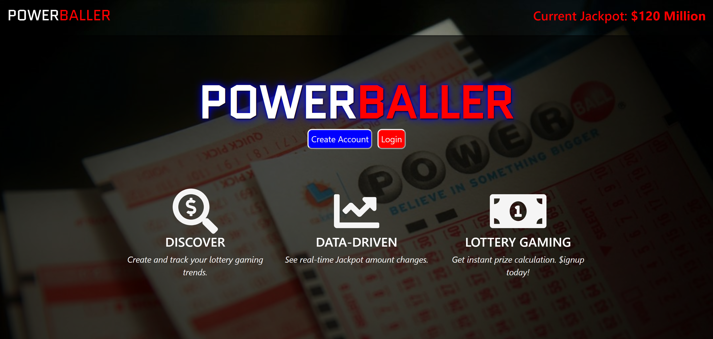

## POWERBALLER | *Data Driven Lottery Gaming*
- ```Developer: Juan Rivera```
- ```Date: March 13, 2020```


 

*****

## Overview

**Powerballer** is a full-stack MERN application that features dynamic, data-driven lottery updates. It features real-time tracking of jackpot amounts and draws. 

Users can enter up to three lottery tickets at a time to compare them with the winning numbers.  The app also features a ticket management tool to view and/or delete past numbers.  

The application currently tracks Powerball lottery games only, but there is a desire to expand this tool to other lottery games.

## Installation Steps
1. Git clone with HTTPS to your local machine ```https://github.com/JuanCodeAtATime/powerballer.git```.
2. In **powerballer** folder (root directory), run ```npm install``` in your terminal to install back-end dependencies.  
3. Then,  ```cd client``` and run ```npm install``` to install front-end dependencies.  
4. Go back to root directory (**powerballer**) by running ``` cd .. ```.
5. Lastly, run ```npm run start``` to launch in your local machine.


### Built With

* **Programming Language:** JavaScript 
* **Runtime Evironment/Sever:**  [Node.js](https://nodejs.org/en/)
* **DBMS:**  [Mongo DB](https://www.mongodb.com/)
* **Libraries:**: [React-Bootstrap](https://react-bootstrap.github.io/), [Moment.js](https://momentjs.com), [Chart.js](https://www.chartjs.org/)
* **Authentication:**  [Passport.js](http://www.passportjs.org/)
* **API's used:** Powerball, NY Gov Lottery Data

### Demo
[Click here](https://drive.google.com/file/d/1c0Qlp7O1RKEgRV0bT6zdnAMyLQMWjaj_/view) for a demo of the app's basic functionality and responsiveness.  

### Check Out Deployed Site
https://powerballers.herokuapp.com


